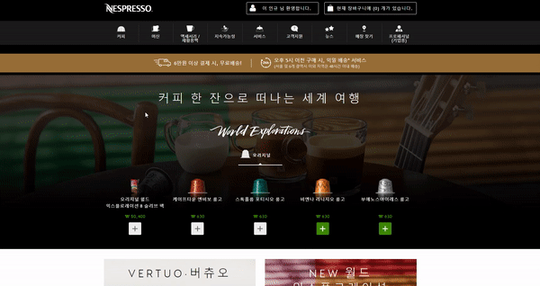
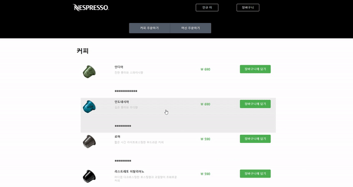
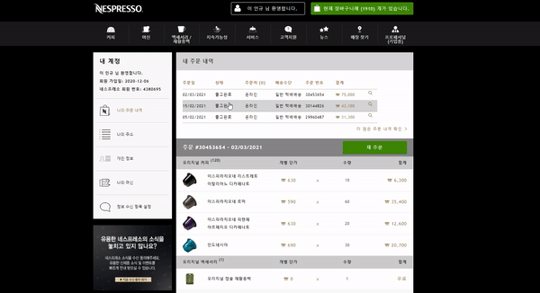
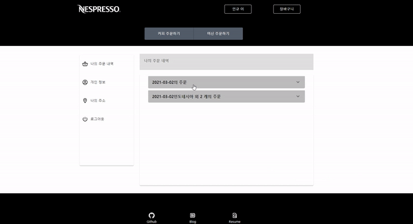

## Nespresso Website Clone

### Client Init

```
1. clone project
2. `yarn` or `npm install` to download packages
3. yarn start or npm start
```

### Server Init

```
1. clone project
2. load maven dependemcies
3. edit yml file(your database configs)
4. run main class
5. test API with Postman
```

### Stack

-   Typescript
-   React
-   Redux
-   Formik, Yup
-   Material UI
-   Java
-   Spring Boot
-   Spring Security(JWT)
-   JPA
-   MySQL

## Description

### Client

-   네스프레소 캡슐 구매를 위해 네스프레소 웹 사이트를 자주 이용하는데, 불편하고 아쉬운 점들을 개선

1. 전체적으로 템플릿 엔진 기반의 SSR 방식을 사용하여 구축된 페이지를 React를 이용한 SPA로 개선
2. 장바구니 및 주문과 같은 핵심적인 기능에서 직관적이지 않은 UI를 직관적인 UI로 바꾸고 SPA를 통해 사용자 경험을 개선



_기존의 네스프레소 장바구니 담기, 버튼 클릭후 나오는 모달이 어떤식으로 작동하는지 직관적으로 보이지 않으며 수량을 눌러도 업데이트가 제대로 되었는지 확인이 되지 않는다._


다

_개선한 네스프레소 장바구니 담기, 버튼 클릭 시 사용법이 명확하며 몇 개의 캡슐이 추가되는지 버튼에 보인다. 캡슐 추가시 상단의 메시지를 통해 추가 캡슐 갯수와 피드백이 직관적인 상황_



_주문 이력을 볼 때 확인하고 싶은 날짜의 주문을 클릭시 사이트 자체가 잠시 멈추며 내가 보고싶은 주문 내용으로 정확히 이동이 되었는지 확인하기가 어렵다._


_주문 이력을 날짜별로 확실하게 확인 가능하며 SPA 방식이라 속도가 빠르며 여러 개의 주문을 확인할 수 도 있다._

-   이 외에도 전체적인 사이트는 반응형으로 제작되었으며 회원정보 변경, 주소 변경, JWT 토큰을 통한 인증 유지도 구현 하였습니다.

### Server

## DB schema

```
User {
	userId: Long; <PK>
	firstName: String;
	lastName: String;
	email: String;
	password: String;
	address: String;

	@OneToMany
	cartItems: List<CartItem>

	@OneToMany
	orders: List<Order>
}

@PostConstruct
Item {
	itemId: Long;<PK>
	itemName: String;
	price: Int;
	description: String;
	itemImage: Array<String>;

	@OneToMany()
	cartItem: List<CartItem>;

	@OneToMany()
	orderItem: List<OrderItem>
}

Capsule extends Item {
	intensity: Int;
	cupSize: CupSize <enum>("ESPRESSO", "LUNGO")
	profile: String;
	note: String;
	origin: String;
}

Machine extends Item {
	machineType: MachineType <enum>("ORIGINAL", "VERTUO")
}

CartItem {
	cartItemId: Long; <PK>
	amoumt: Int;

	@ManyToOne
	user: User

	@ManyToOne
	item: Item
}

OrderItem {
	orderItemId: Long; <PK>
	amount: Int

	@ManyToOne
	item: Item

	@ManyToOne
	order: Order
}

Order {
	orderId: Long; <PK>
	orderDate: Date;
	@OneToMany
	orderItems: List<OrderItem>

	@ManyToOne
	user: User
}

```

-   최근 팀 프로젝트 진행 경험으로 DB 스키마 및 API 설계, 개발 순서 확립 및 파일 구조등의 중요성을 느끼고 스키마를 먼저 간단하게 작성

```java
@Configuration
@AllArgsConstructor
@EnableWebSecurity
public class SecurityConfig extends WebSecurityConfigurerAdapter {

    private CustomUserDetailsService customUserDetailsService;
    private JwtFilter jwtFilter;
    @Value("${util.client}")
    private static String CLIENT;

    @Override
    protected void configure(AuthenticationManagerBuilder auth) throws Exception {
        auth.userDetailsService(customUserDetailsService);
    }

    @Bean
    public PasswordEncoder passwordEncoder() {
        return new BCryptPasswordEncoder(10);
    }

    @Bean(name = BeanIds.AUTHENTICATION_MANAGER)
    @Override
    public AuthenticationManager authenticationManagerBean() throws Exception {
        return super.authenticationManagerBean();
    }

    @Override
    protected void configure(HttpSecurity http) throws Exception {
        http.cors().and().csrf().disable()
                .authorizeRequests()
                .antMatchers("/user/signup", "/user/login", "/exception/**","/item/**")
                .permitAll()
                .anyRequest()
                .authenticated()
                .and()
                .exceptionHandling().authenticationEntryPoint(new AuthenticationExceptionHandler())
                .and()
                .sessionManagement()
                .sessionCreationPolicy(SessionCreationPolicy.STATELESS);

        http.addFilterBefore(jwtFilter, UsernamePasswordAuthenticationFilter.class);
    }
}
```

-   JWT 필터와 Cors를 추가한 Spring Security 세팅

-   ControllerAdvice를 통한 에러 처리, 관련된 내용은 [블로그](https://velog.io/@peppermint100/Spring-Boot-%EC%98%88%EC%99%B8-%EC%B2%98%EB%A6%AC)에 정리

-   Spring Boot와 Spring Security, JPA의 전체적인 구조 및 사용 방법을 익히고 환경 변수를 숨기거나 static한 String 값(JSON 응답 메시지, 해쉬 키 밸류 등)은 따로 클래스를 줌으로서 구조를 개선하고 클린 코드를 작성함(~~또는 하화려고 노력함~~)

-   swagger ui를 통한 api 문서화
